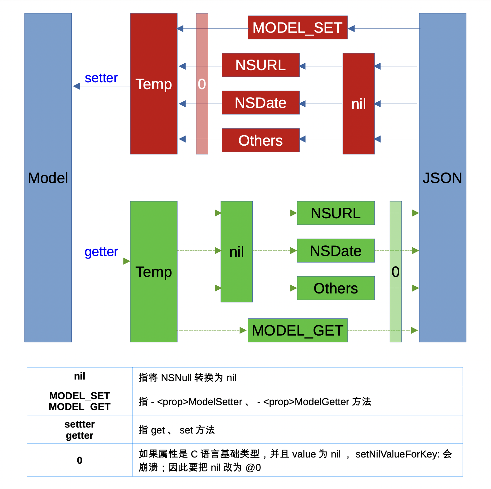

# NSModeling

`模型` <=> `字典`、`模型` <=> `JSON` 互转；采用`NSModeling` 或 `NSJsoning`协议即可使用。


## 为啥重复造轮子

对比 [Mantle](https://github.com/Mantle/Mantle)、[jsonmodel](https://github.com/jsonmodel/jsonmodel)、[MJExtension](https://github.com/CoderMJLee/MJExtension)、[NSModeling](https://github.com/westfourth/NSModeling) 特点：

|  | [MJExtension](https://github.com/CoderMJLee/MJExtension) | [jsonmodel](https://github.com/jsonmodel/jsonmodel) | [Mantle](https://github.com/Mantle/Mantle) | [NSModeling](https://github.com/westfourth/NSModeling) |
| :-: | :-: | :-: | :-: | :-: |
| **使用方式** | 分类 | 继承 | 继承 | 协议 |
| **适用性** | - | - | 高级开发者 | - |
| **规范性** | - | - | 非常规范 | - |
| **严格性** | - | - | 数据类型严格 | - |
| **调试性** | - | - | 不易调试 | - |
| **方法名** | 晦涩 | 简明 | 一般 | 非常简明 |
| **嵌套模型** | 直接转换 | 直接转换 | 指明子模型类 | 直接转换 |
| **嵌套数组** | 字典指明类型 | 伪协议指明类型 | 方法指明类型 | 伪协议指明类型 |
| **属性映射** | 可选 | 可选 | 必须 | 可选 |
| **忽略属性** | 不支持 | 支持 | 不支持 | 支持 |
| **Ignore、Optional** | 不支持 | 支持 | 不支持 | 不支持 |
| **transformer** | 不支持 | 不支持 | 支持 | 不支持 |
| **getter、setter** | 不支持 | 支持 | 不支持 | 支持 |

# 设计



## 举例

**TestObject**

``` objc
//	只申明，无具体形式
@protocol SubTestObject;

//	.h文件
@interface TestObject : NSObject <NSJsoning>

@property (nonatomic) NSString *name;
@property (nonatomic) int age;
@property (nonatomic) NSURL *url;
@property (nonatomic) NSDate *date;

@property (nonatomic) SubTestObject *sub;
@property (nonatomic) NSArray<SubTestObject *> <SubTestObject> *list;

@end

//	.m文件
@implementation TestObject
@end
```

**SubTestObject**

``` objc
//	.h文件
@interface SubTestObject : NSObject <NSJsoning>

@property (nonatomic) NSString *text;
@property (nonatomic) int num;
@property (nonatomic) SubTestObject *sub;

@end

//	.m文件
@implementation SubTestObject
@end
```

# 使用

## 1. 字典

**采用`NSJsoning`协议即可**

``` objc
@interface TestObject : NSObject <NSJsoning>
@end
```

**调用**

``` objc
    TestObject *t =  [TestObject new];
    t.name = @"AAA";
    t.age = 123;
    t.url = [NSURL URLWithString:@"https://www.baidu.com"];
    t.date = [NSDate date];
    
    //	模型 => 字典
    NSDictionary *dict = [t toDict];
    //	字典 => 模型
    TestObject *t2 = [[TestObject alloc] fromDict:dict];
    //	模型 => JSON
    NSString *text = [t toJsonString];
    //	JSON => 模型
    TestObject *t3 = [[TestObject alloc] fromJsonString:text];
```

## 2. 数组 

``` objc
    TestObject *t1 =  [TestObject new];
    t1.name = @"AAA";
    t1.age = 123;
    
    TestObject *t2 =  [TestObject new];
    t2.name = @"AAA";
    t2.age = 123;
    
    NSArray *array1 = [t1, t2];
    NSArray<NSDictionary *> *array2 = [TestObject toDict:array1];
    NSArray<TestObject *> *array3 = [TestObject fromDict:array2];
```

## 3. 嵌套字典

嵌套子模型也采用`NSJsoning`协议即可

``` objc
//	.h文件
@interface SubTestObject : NSObject <NSJsoning>
@end

```

## 4. 嵌套数组

使用`protocol`声明数组元素的类型即可

``` objc
//	只申明，无具体形式
@protocol SubTestObject;

//	.h文件
@interface TestObject : NSObject <NSJsoning>

@property (nonatomic) NSArray <SubTestObject> *list;

@end

```

## 5. 属性映射

实现`+ (NSDictionary *)dictMapper`即可

``` objc
@implementation TestObject

+ (NSDictionary *)dictMapper {
    return @{@"name": @"firstName",
             @"age": @"year",
    };
}

@end
```

[Mantle](https://github.com/Mantle/Mantle)、[jsonmodel](https://github.com/jsonmodel/jsonmodel)、[MJExtension](https://github.com/CoderMJLee/MJExtension) 都支持多级属性映射（`valueForKeyPath:`），[NSModeling](https://github.com/westfourth/NSModeling) 特意去掉多级属性映射（`valueForKey:`）。**原因是在实际开发过程中，多级属性映射易造成模型混乱**，去掉多级属性映射，让模型跟后台接口数据结构保持一致。

## 6. 忽略属性

``` objc
+ (NSArray<NSString *> *)ignoreProperties {
    return @[@"age"];
}
```

## 7. 自定义getter、setter

``` objc
@implementation TestObject

//	字典 => 模型
MODEL_SET(date) {
    return @"2020-12-22 21:44:49";
}

//	模型 => 字典
MODEL_GET(date) {
    return [[NSDate date] dateByAddingTimeInterval:60 * 60 * 24 * 7];
}

@end
```

和下面完全相等

``` objc
@implementation TestObject

//	字典 => 模型
- (id)dateModelSetter:(id)value {
    return @"2020-12-22 21:44:49";
}

//	模型 => 字典
- (id)dateModelGetter:(id)value {
    return [[NSDate date] dateByAddingTimeInterval:60 * 60 * 24 * 7];
}

@end
```

## 8. `NSNull`、`NSURL`、`NSDate`自动转换

``` objc
@implementation TestObject

//	关闭 NSNull => nil 自动转。
+ (BOOL)automaticNil {
    return NO;
}

//	NSString <=> NSURL 自动互转。
+ (BOOL)automaticURL {
    return YES;
}

//	NSString <=> NSDate 自动互转。
+ (BOOL)automaticDate {
    return YES;
}

@end
```

## 9. enum枚举

``` objc
MODEL_ENUM(state, (@{@"open": @(GTIssuesStateOpen),
                     @"close": @(GTIssuesStateClose)
                   }))
```


# 优先级

`MODEL_SET`、`MODEL_GET` **>** `automaticXXX方法` **>** `NSModelConfig全局配置`